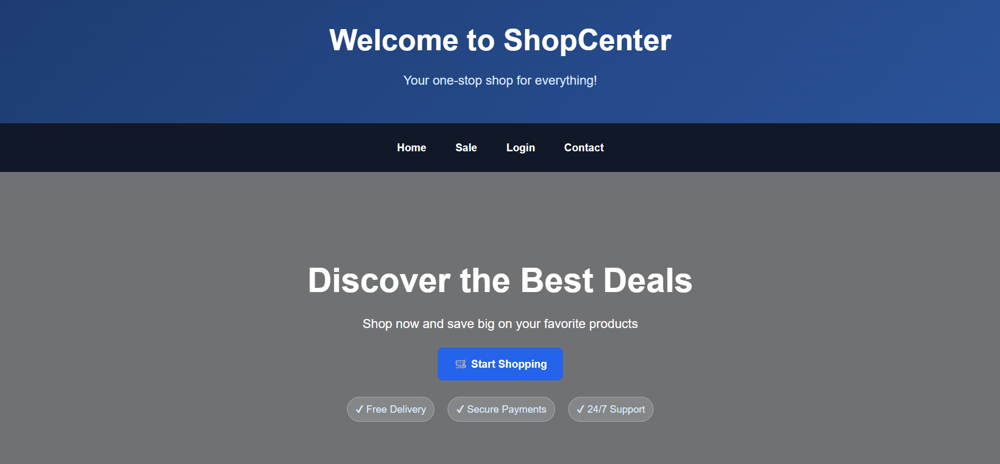
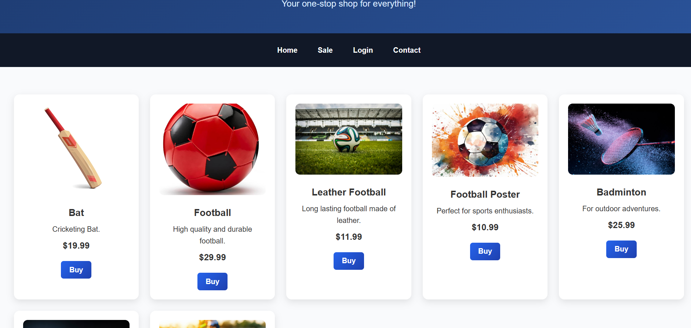
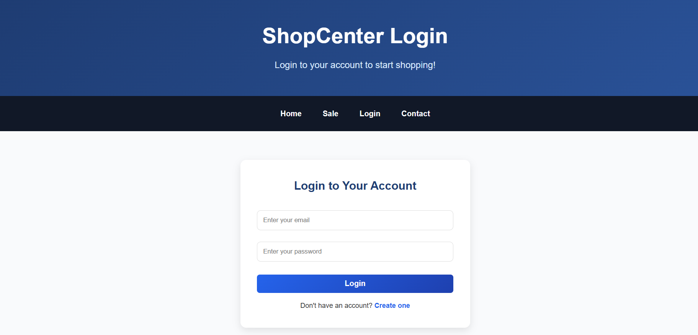
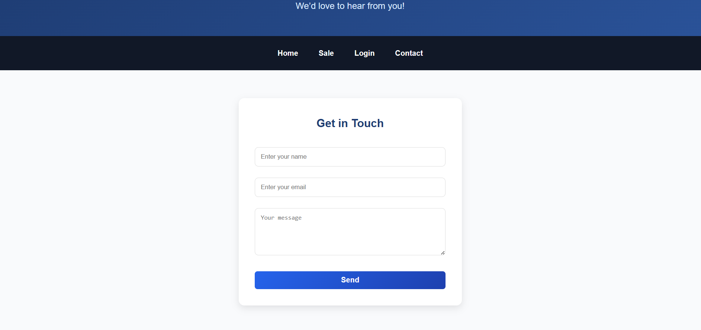

# 🛍️ ShopCenter – E-Commerce Website

  
  

  
  

A modern **e-commerce website** built using **HTML, CSS, JavaScript, and PHP**.  
This project features a polished design, structured pages, and a simple backend for handling logins, registrations, and product purchases.

---

## ✨ Features

- ✅ **Homepage (index.html)** with hero banner, CTA button, highlights, and featured products.  
- ✅ **Shop (shop.html)** showcasing products in a modern grid layout with hover effects.  
- ✅ **Login (login.html)** with styled form card.  
- ✅ **Register (newaccount.html)** with consistent design matching login.  
- ✅ **Contact (contact.html)** with a modern contact form.  
- ✅ **Footer with social media links** across all pages.  
- ✅ **Toast notifications (via `script.js`)** for user actions.  
- ✅ **Responsive design** – works on desktops, tablets, and mobile devices.  

---

## 📂 Project Structure

📦 shopcenter
┣ 📜 index.html # Homepage
┣ 📜 shop.html # Shop / Products page
┣ 📜 login.html # Login page
┣ 📜 newaccount.html # Register page
┣ 📜 contact.html # Contact page
┣ 📜 style.css # Centralized styles for all pages
┣ 📜 script.js # JavaScript interactions (toast, effects, etc.)
┣ 📜 buy.php # PHP script for handling product purchases
┣ 📜 login.php # PHP script for handling login logic
┣ 📜 register.php # PHP script for handling account creation 

---

⚡ Technologies Used

Frontend: HTML5, CSS3, JavaScript

Backend: PHP

Database: MySQL (optional, for login/register)

Icons/Media: Free stock images & emojis